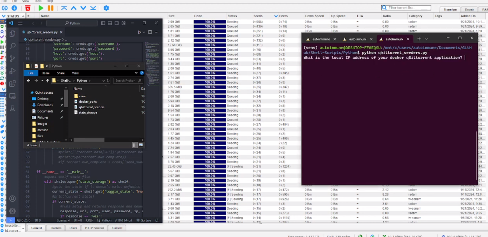

# Qbittorrent Seeder Remover Python Script

This Python script is designed to manage the seeding torrents in your Qbittorrent client. It allows you to define a threshold for the total number of seeds associated with a torrent file within the swarm. Any torrent exceeding this user-specified limit will be eliminated.

## Initial Execution

Upon initial execution of the script, it will prompt you to define the seed threshold. Once this is done, the script will generate two files:

1. **State Storage File**: This file stores the state of the script.
2. **Credentials File**: This file stores the necessary credentials.

These files facilitate the automation of the script and allow it to be incorporated into a cron job or service.

## Subsequent Executions

For subsequent executions of the script, it will retrieve the necessary information from the previously created state storage and credentials files. This ensures the efficient management of your seeding torrents by maintaining their numbers within the defined limits.

## Demonstration

Click on the image below to view a demonstration of the script on YouTube:

Please note that the actual image will not be displayed in this text. In your README file, replace `qbittorrent_seeders_image.png` with the actual path to your image file.